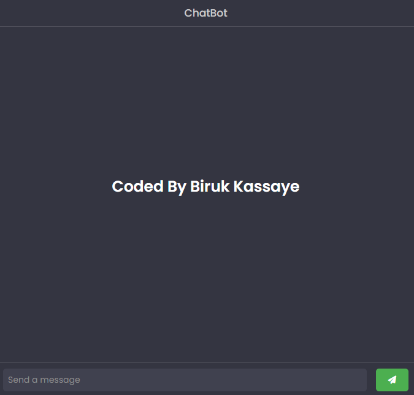

# Chatbot Project

This project is a simple chatbot application that interacts with users through text input.

## Description

The chatbot utilizes the OpenAI GPT-3.5 model to generate responses based on user input. It sends requests to the OpenAI API and displays the responses in the chat interface.

